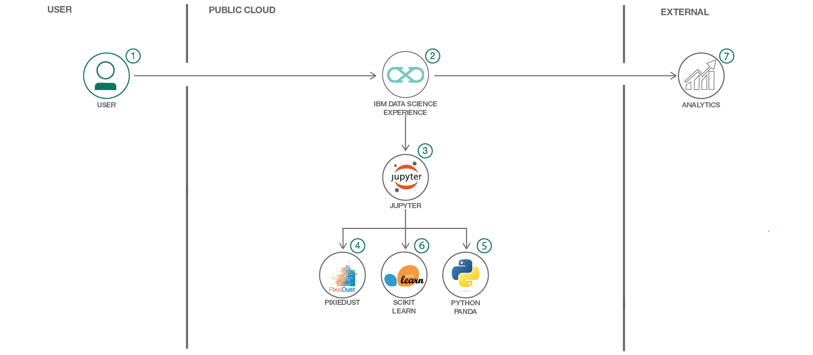
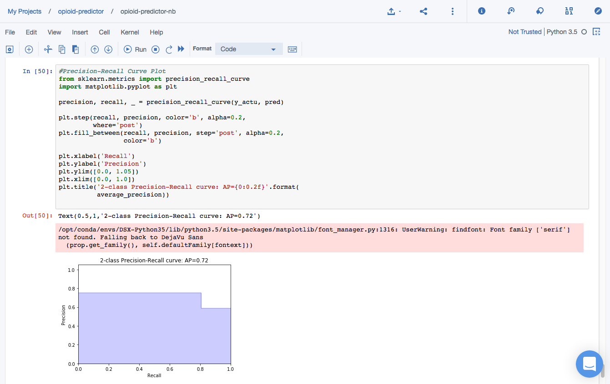

# Use Machine Learning to Predict U.S. Opioid Prescribers with Watson Studio and Scikit Learn

This Code Pattern will focus on and guide you through how to use `scikit learn` and `python` in Watson Studio to predict opioid prescribers based off of a [2014 kaggle dataset](https://www.kaggle.com/apryor6/us-opiate-prescriptions/data).

Opioid prescriptions and overdoses are becoming an increasingly overwhelming problem for the United States, even causing a declared state of emergency in recent months. Though we, as data scientists, may not be able to single handedly fix this problem, we can dive into the data and figure out what exactly is going on and what may happen in the future given current circumstances.

This Code Pattern aims to do just that: it dives into a kaggle dataset which looks at opioid overdose deaths by state as well as different, unique physicians, their credentials, specialties, whether or not they've prescribed opioids in 2014 as well as the specific names of the prescriptions they have prescribed. Follow along to see how to explore the data in a Watson Studio notebook, visualize a few initial findings in a variety of ways, including geographically, using Pixie Dust. Pixie Dust is a great library to use when you need to explore your data visually very quickly. It literally only needs one line of code! Once that initial exploration is complete, this Code Pattern uses the machine learning library, scikit learn, to train several models and figure out which have the most accurate predictions of opioid prescriptions. Scikit learn, if you're unfamiliar, is a machine learning library, which is commonly used by data scientists due to its ease of use. Specifically, by using the library you're able to easily access a number of machine learning classifiers which you can implement with relatively minimal lines of code. Even more, scikit learn allows you to visualize your output, showcasing your findings. Because of this, the library is often used in machine learning classes to teach what different classifiers do- much like the comparative output this Code Pattern highlights! Ready to dive in?

#### Notebooks

* [opioid-prescription-prediction.ipynb](notebooks/opioid-prescription-prediction.ipynb): The notebook we'll be using with no output.

## Flow

1. Log into IBM's Watson Studio service.
2. Upload the data as a data asset into Watson Studio.
3. Start a notebook in Watson Studio and input the data asset previously created.
4. Explore the data with pandas
5. Create data visualizations with Pixie Dust.
6. Train machine learning models with scikit learn.
7. Evaluate their prediction performance.

## Included components

* [IBM Watson Studio](https://dataplatform.cloud.ibm.com/): Analyze data using RStudio, Jupyter, and Python in a configured, collaborative environment that includes IBM value-adds, such as managed Spark.
* [Jupyter Notebook](https://jupyter.org/): An open source web application that allows you to create and share documents that contain live code, equations, visualizations, and explanatory text.
* [PixieDust](https://github.com/pixiedust/pixiedust): Provides a Python helper library for IPython Notebook.

## Featured technologies

* [Data Science](https://medium.com/ibm-data-science-experience/): Systems and scientific methods to analyze structured and unstructured data in order to extract knowledge and insights.
* [Python](https://www.python.org/): Python is a programming language that lets you work more quickly and integrate your systems more effectively.
* [pandas](https://pandas.pydata.org/): A Python library providing high-performance, easy-to-use data structures.

## Steps

This Code Pattern consists of two activities:

* [Run a Jupyter notebook in the IBM Watson Studio](#run-using-a-jupyter-notebook-in-the-ibm-watson-studio).
* [Analyze and Predict the data](#analyze-and-predict-the-data).

## Run using a Jupyter notebook in the IBM Watson Studio

1. [Create a new Watson Studio project](#1-create-a-new-watson-studio-project)
2. [Create the notebook](#2-create-the-notebook)
3. [Upload data](#3-upload-data)
4. [Run the notebook](#4-run-the-notebook)

### 1. Create a new Watson Studio project

* Log into IBM's [Watson Studio](https://dataplatform.cloud.ibm.com). Once in, you'll land on the dashboard.

* Create a new project by clicking `+ New project` and choosing `Data Science`:

  

* Enter a name for the project name and click `Create`.

* **NOTE**: By creating a project in Watson Studio a free tier `Object Storage` service and `Watson Machine Learning` service will be created in your IBM Cloud account. Select the `Free` storage type to avoid fees.

  

* Upon a successful project creation, you are taken to a dashboard view of your project. Take note of the `Assets` and `Settings` tabs, we'll be using them to associate our project with any external assets (datasets and notebooks) and any IBM cloud services.

  

### 2. Create the Notebook

* From the new project `Overview` panel, click `+ Add to project` on the top right and choose the `Notebook` asset type.

* Fill in the following information:

  * Select the `From URL` tab. [1]
  * Enter a `Name` for the notebook and optionally a description. [2]
  * Under `Notebook URL` provide the following url: [https://github.com/IBM/predict-opioid-prescribers/blob/master/notebooks/opioid-prescription-prediction.ipynb](https://github.com/IBM/predict-opioid-prescribers/blob/master/notebooks/opioid-prescription-prediction.ipynb) [3]
  * For `Runtime` select the `Python 3.5` option. [4]

  

* Click the `Create` button.

* **TIP:** Once successfully imported, the notebook should appear in the `Notebooks` section of the `Assets` tab.

### 3. Upload data

* This notebook uses the datasets: [opioids.csv](data/opioids.csv), [overdoses.csv](data/overdoses.csv), and [perscriber-info.csv](data/perscriber-info.csv). We need to load these assets to our project.

* From the new project `Overview` panel, click `+ Add to project` on the top right and choose the `Data` asset type.

   

* A panel on the right of the screen will appear to assit you in uploading data. Follow the numbered steps in the image below.

  * Ensure you're on the `Load` tab. [1]
  * Click on the `browse` option. From your machine, browse to the location of the `[opioids.csv`, `overdoses.csv` and `perscriber-info.csv` files in this repository, and upload it. [not numbered]
  * Once uploaded, go to the `Files` tab. [2]
  * Ensure the files appear. [3]

   

* Now all assets should appear in your project overview.

   

### 4. Run the notebook

* Click the `(►) Run` button to start stepping through the notebook.

* Stop at the `Insert Pandas Data Frame` sections.

* Click on the `1001` data icon in the top right. The data files should show up.

* Click on each and select `Insert Pandas Data Frame`. Once you do that, a whole bunch of code will show up in the highlighted cell.

* Make sure your ``opioids.csv`` is saved as ``df_data_1``, ``overdoses.csv`` is saved as ``df_data_2`` and ``prescriber_info.csv`` is saved as ``df_data_3`` so that it is consistent with the original notebook.

## Analyze and Predict the data

### 1. Explore the different datasets using python, pandas and Pixie Dust

To get familiar with your data, explore it with visualizations and by looking at subsets of the data. For example, we see that though California has the highest overdoses, when we correct for population we see that West Virginia actually has the highest rate of overdoses per capita.

### 2. Clean the data using python

Every dataset has its imperfections. Let's clean ours up by making the States consistent and changing our columns to allow us to use them as integers.

### 3. Run several models to predict opioid prescribers using scikit learn

You can check out the output in the notebook or in the image below. In this step we run several machine learning models in order to evaluate which is the most effective at predicting opioid prescribers. Though it is beyond the scope of this pattern, by predicting these opioid prescribers you are laying the framework to predict the likelihood that a certain type of doctor prescribes opioids. Additionally, if we had more years of data (beyond 2014) we could also predict future rates of overdoses. For now, we'll just take a look at the models.

## Sample output

After running various classifiers, we find that Random Forest, Gradient Boosting and our Ensemble models had the best performance on predicting opioid prescribers.

Awesome job following along! Now go try and take this further or apply it to a different use case!

## Links

* [Data Set](https://www.kaggle.com/apryor6/us-opiate-prescriptions/data)

## Learn more

* **Data Analytics Code Patterns**: Enjoyed this Code Pattern? Check out our other [Data Analytics Code Patterns](https://developer.ibm.com/technologies/data-science/)
* **AI and Data Code Pattern Playlist**: Bookmark our [playlist](https://www.youtube.com/playlist?list=PLzUbsvIyrNfknNewObx5N7uGZ5FKH0Fde) with all of our Code Pattern videos
* **Watson Studio**: Master the art of data science with IBM's [Watson Studio](https://dataplatform.cloud.ibm.com/)

## License

This code pattern is licensed under the Apache Software License, Version 2.  Separate third party code objects invoked within this code pattern are licensed by their respective providers pursuant to their own separate licenses. Contributions are subject to the [Developer Certificate of Origin, Version 1.1 (DCO)](https://developercertificate.org/) and the [Apache Software License, Version 2](https://www.apache.org/licenses/LICENSE-2.0.txt).

[Apache Software License (ASL) FAQ](https://www.apache.org/foundation/license-faq.html#WhatDoesItMEAN)
